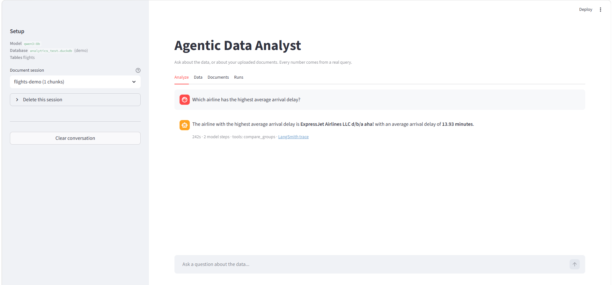
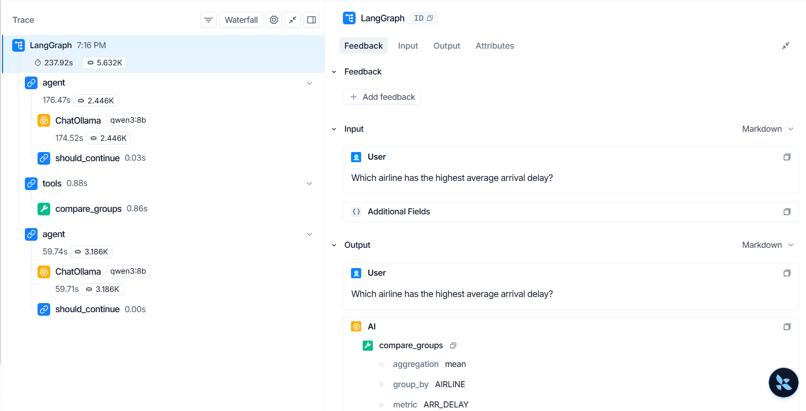
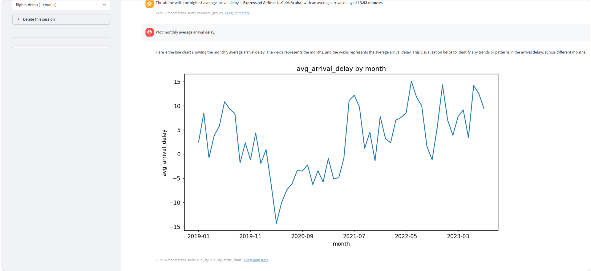
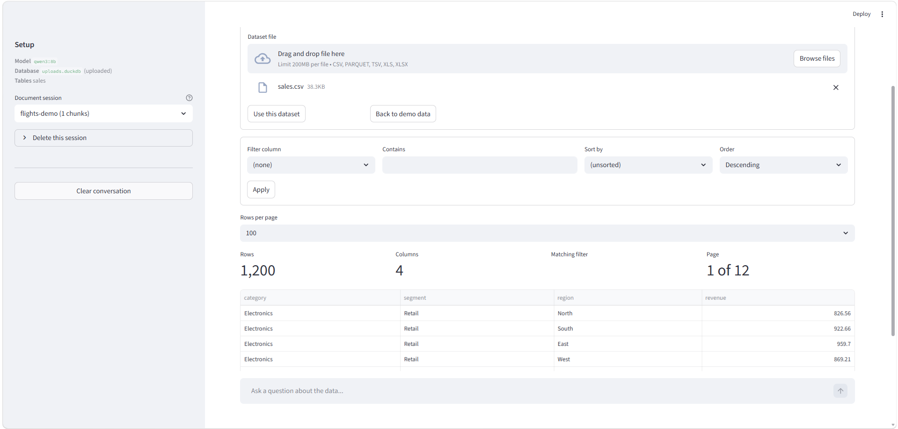
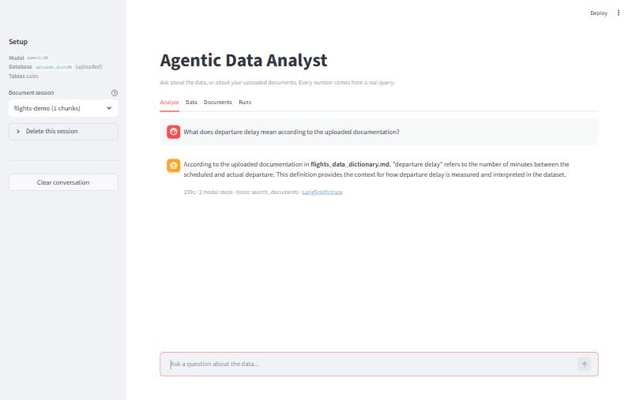

# Agentic AI Data Analyst

A natural-language analytics application. You ask a question in plain English; a
[LangGraph](https://langchain-ai.github.io/langgraph/) agent decides which tools to call, runs real SQL
against DuckDB, computes statistics with SciPy, draws charts with Matplotlib, and retrieves context from
your own uploaded documents. Nothing is estimated by the language model — every number in an answer comes
from a tool that actually executed, and the model's job is to choose the tools and explain the result.



*The agent chose `compare_groups`; the footer reports elapsed time, model steps, the tools used, and a
link to the run's LangSmith trace.*

## Features

- **Agentic tool selection with LangGraph** — an explicit `agent ⇄ tools` loop; the model picks the tools,
  the order, and when it has enough to answer. Tool errors are returned to the model, which corrects and retries.
- **SQL analytics on DuckDB** — read-only at the engine level, so the agent can query but never modify data.
- **Deterministic statistics** — one-way ANOVA, correlation, outlier detection and distribution summaries
  computed in Pandas/SciPy, not by the model.
- **Visualization** — bar, line, scatter and histogram charts rendered with Matplotlib.
- **Dataset upload** — CSV, TSV, Excel (`.xlsx`/`.xls`) and Parquet files are registered into DuckDB and
  become the active dataset for subsequent questions.
- **Document RAG** — PDF, DOCX, Markdown and TXT indexed with LlamaIndex into a persistent ChromaDB store,
  with answers citing the source filename.
- **LangSmith tracing and evaluation** — every run is traced, and a deterministic evaluation suite scores
  agent behaviour without using an LLM judge.

## Architecture

```
User question
      │
      ▼
┌─────────────────┐   tool calls    ┌──────────────────────────────────────┐
│  LangGraph      │ ──────────────▶ │  Analytical tools                    │
│  agent node     │                 │                                      │
│  (LLM decides)  │ ◀────────────── │  SQL · statistics · charts · RAG     │
└─────────────────┘   tool results  └──────────────────────────────────────┘
      │                                          │
      │ no more tool calls                       ├── DuckDB      (run_sql, compare_groups)
      ▼                                          ├── Pandas/SciPy (correlate, outliers, distribution)
Grounded final answer                            ├── Matplotlib  (make_chart)
                                                 └── LlamaIndex + ChromaDB (search_documents)
```

### How the loop works

The agent node sends the question, the live database schema and the tool definitions to the LLM. If the
reply contains tool calls, the tools node executes them and feeds the results back; the loop repeats until
the model answers with no further tool calls, or a step cap is reached.

The division of labour is the point: **the LLM chooses, the tools compute.** `compare_groups` aggregates
in the database and runs the ANOVA itself, so a ranked comparison plus its significance test is one call
returning a compact structured result — raw rows never enter the model's context. Constraints that matter
for correctness are enforced in code rather than by instruction: the database connection is read-only,
`run_sql` rejects `SELECT *`, statistical tools refuse results drawn from a `LIMIT`ed query, and retrieved
document filenames are always credited.

Nine tools are available: `list_tables`, `describe_table`, `run_sql`, `compare_groups`, `correlate`,
`find_outliers`, `describe_distribution`, `make_chart`, `search_documents`.

## Screenshots

**LangSmith trace** — the run shown at the top of this README, as an `agent → tools → agent` loop: each
`ChatOllama` call timed, and the exact arguments the model passed to `compare_groups`.



**Visualization** — a follow-up request; the agent queried the data and called `make_chart`, and the
Matplotlib line chart is rendered inline.



**Dataset upload** — after uploading `sales.csv`, the sidebar switches to `uploads.duckdb (uploaded)` with
table `sales`, and the Data tab pages through the new dataset.



**Indexed documents** — the Documents tab lists each indexed file and expands to show the exact chunks the
retriever can see, which is what `search_documents` searches and cites.



## Tech stack

| Layer | Technology |
|---|---|
| Agent orchestration | LangGraph |
| LLM interface & tools | LangChain, `langchain-ollama` |
| Model runtime | Ollama (default `qwen3:8b`, configurable) |
| Analytical database | DuckDB via SQLAlchemy (`duckdb-engine`) |
| Statistics | Pandas, SciPy |
| Visualization | Matplotlib |
| Document indexing | LlamaIndex, ChromaDB, `sentence-transformers` |
| File parsing | `pypdf`, `docx2txt`, `openpyxl`, `pyarrow` |
| UI | Streamlit |
| Observability & evaluation | LangSmith, pytest |

## Example questions

```
How many flights departed from origin airport HNL?
Which airline has the highest average arrival delay?
Compare average arrival delay across airlines and determine whether the differences are statistically significant.
Plot monthly average arrival delay.
What are the total sales by region?
```

The last one runs against an uploaded sales dataset — the same agent, no code changes.

## Evaluation

The suite is **deterministic: no LLM judge.** Every score is computed from the agent's own tool calls and
tool outputs, so the same run always produces the same score. Cases cover basic and semantic SQL,
statistical analysis, visualization, RAG, combined SQL+RAG, regression cases for previously observed bugs,
and questions the data cannot answer.

Latest results:

| Evaluator | Result |
|---|---|
| `correct_tool` | 15 / 15 |
| `correct_columns` | 7 / 7 |
| `no_fabricated_numbers` | 18 / 18 |
| `cited_source` | 2 / 2 |
| `stat_correct` | 3 / 3 |
| `groups_reported` | 2 / 2 |
| **Flight evaluation (all checks)** | **56 / 57** |
| **Sales evaluation (all checks)** | **15 / 15** |
| Unit tests | 17 passing, 2 skipped (document-retrieval tests are opt-in) |

The single failed flight check was a brittle assertion in the test data, not an agent error: the case
expected the substring `"not"` while the agent correctly replied *"There is **no** ticket price column in
this data"* and listed the columns that do exist. This is not a claim of 100% accuracy — answer quality
depends on the model, and the known limitations below are real.

Run it:

```bash
pytest tests --ignore=tests/langsmith_eval.py   # unit tests
python tests/langsmith_eval.py --smoke      # 3 cases, verifies the harness
python tests/langsmith_eval.py              # full flight suite, results to LangSmith
python tests/langsmith_eval.py --sales      # non-flight dataset cases
python tests/langsmith_eval.py --local      # skip LangSmith upload
```

## Setup

**Prerequisites:** Python 3.11+ and [Ollama](https://ollama.com) installed and running.

```bash
git clone https://github.com/Vishal462/agentic-data-analyst.git
cd agentic-data-analyst
```

```bash
python -m venv .venv
```

```bash
# Windows
.venv\Scripts\activate
# macOS / Linux
source .venv/bin/activate
```

```bash
pip install -r requirements.txt
```

```bash
ollama pull qwen3:8b
```

```bash
cp .env.example .env
```

Then edit `.env` and add your LangSmith key (tracing is optional — the app runs without it):

```
LANGSMITH_TRACING=true
LANGSMITH_API_KEY=your-key-here
LANGSMITH_PROJECT=agentic-data-analyst
```

Optional overrides: `DATA_ANALYST_MODEL` (default `qwen3:8b`), `DATA_ANALYST_REASONING`,
`DATA_ANALYST_DB_PATH`, `DATA_ANALYST_UPLOAD_DB_PATH`.

Run the app:

```bash
streamlit run streamlit_app.py
```

Or use the command line:

```bash
python ask.py "Which airline has the highest average arrival delay?"
```

`python ask.py` with no arguments starts an interactive prompt; `--trace` prints every tool call and
result, and `--session <name>` selects the document collection to search.

## Datasets

Upload is the primary path: any CSV, TSV, Excel or Parquet file dropped into the **Data** tab is loaded
into DuckDB, becomes the active dataset, and is immediately queryable — no code changes and no manual
database setup. A safe table name is derived from the filename, the file is loaded into a staging table
first so a malformed upload cannot destroy the dataset currently in use, and each upload replaces the
previous one so the schema stays unambiguous.

`tests/fixtures/sales.csv` is included as a small ready-to-use example. Larger datasets — including the
flights database used during development — are generated locally and are **not** committed to this
repository; point `DATA_ANALYST_DB_PATH` at a local DuckDB file to use one.

The **Data** tab also browses the active table with server-side pagination, filtering and sorting, so
large tables never load into the browser.

## Documents (RAG)

Documents are uploaded per named **session** in the **Documents** tab. Each file is chunked, embedded with
a local `sentence-transformers` model and stored in a persistent ChromaDB collection, so an index survives
restarts. Re-uploading the same content is skipped via content hashing.

Retrieval returns the passages *and* their source filenames, and the final answer credits those filenames.
Sessions can be switched from a dropdown to return to a previous index, deleted when no longer needed, and
each indexed document can be expanded to read exactly the chunks the retriever can see.

## Limitations

- **A reachable Ollama endpoint is required.** The app talks to Ollama, so it needs one running locally
  (or a remote endpoint configured). It starts without one — showing an empty dataset prompt — but cannot
  answer questions.
- **Latency depends on hardware.** A question typically takes from tens of seconds to a few minutes on
  consumer hardware.
- **Semantic interpretation is bounded by the model.** Mapping ambiguous wording onto the right column is
  the model's job; a stronger model interprets questions more reliably. Guarantees that matter for
  correctness are enforced in code, not left to the prompt.
- **RAG quality depends on the documents.** Retrieval can only surface what was uploaded and chunked.
- **Intended for local and demonstration use.** Single-session, no authentication, and not hardened for
  multi-user deployment.

## Project structure

```
agentic-data-analyst/
├── app/
│   ├── agent.py                 LangGraph agent ⇄ tools loop, streaming, tracing
│   ├── tools.py                 the nine tools the agent chooses between
│   ├── db.py                    DuckDB access, dataset registration, schema discovery
│   ├── llm.py                   single place the chat model is configured
│   ├── python_analysis.py       ANOVA and descriptive statistics
│   ├── visualization.py         Matplotlib chart rendering
│   ├── rag/
│   │   ├── ingestion.py         chunking, deduplication, indexing
│   │   ├── retriever.py         source-aware retrieval
│   │   ├── vector_store.py      ChromaDB sessions and inspection
│   │   └── cli.py               command-line document indexing
│   ├── analyst.py               earlier deterministic pipeline, kept as a baseline
│   ├── analyst_state.py         state schema for the baseline pipeline
│   ├── planner.py               baseline: schema-driven analysis planning
│   ├── semantic_validation.py   baseline: checks generated SQL matches the plan
│   └── lanchain_sql_agent.py    baseline: LangChain SQL toolkit workflow
├── tests/
│   ├── langsmith_eval.py        deterministic evaluation runner and evaluators
│   ├── eval_cases.json          evaluation cases and reference values
│   ├── test_generic_core.py     planning and statistics on arbitrary schemas
│   ├── test_llm_output_and_matching.py  model-output cleaning, column matching
│   ├── test_semantic_validation.py      plan/SQL agreement checks
│   ├── test_rag_integration.py  document ingestion and retrieval (opt-in)
│   └── fixtures/sales.csv       small non-flight dataset
├── assets/                      screenshots used in this README
├── streamlit_app.py             Streamlit UI: Analyze · Data · Documents · Runs
├── ask.py                       command-line runner
├── requirements.txt
└── .env.example
```

`analyst.py`, `analyst_state.py`, `planner.py`, `semantic_validation.py` and `lanchain_sql_agent.py` are
the earlier deterministic plan-and-route implementation. They are retained as a baseline for comparison
and are **not** wired into the running application — the agent loop is the only path the app uses.
